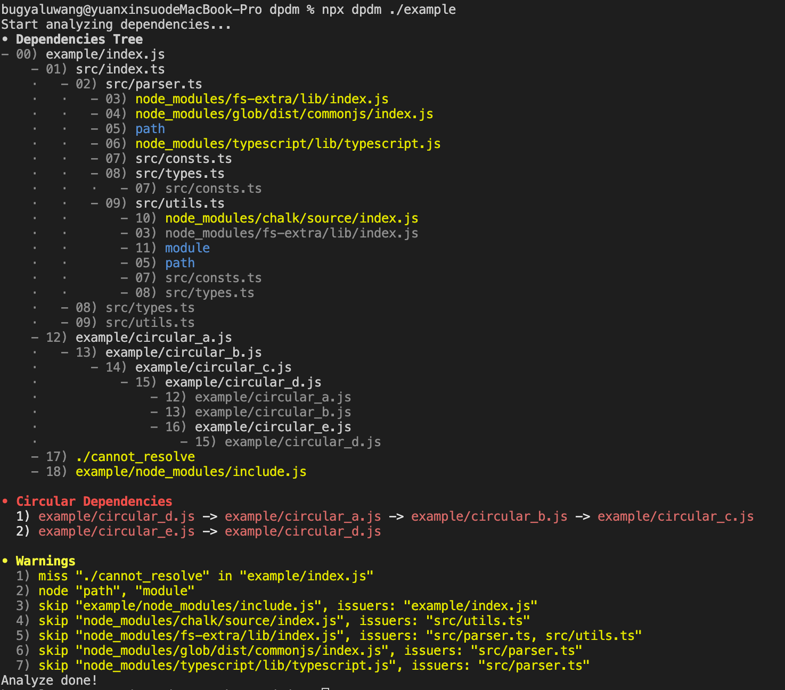

<h1 align="center">
    dpdm-fast
    <br/>
    
    
    
    
    
</h1>

<p align="center">A robust static dependency analyzer for your <code>JavaScript</code> and <code>TypeScript</code> projects with <code>Rust</code> !</p>

<p align="center">
    <a href="#highlights">Highlights</a>
    <span>&nbsp;|&nbsp;</span>
    <a href="#install">Install</a>
    <span>&nbsp;|&nbsp;</span>
    <a href="#usage-in-command-line">Usage</a>
    <span>&nbsp;|&nbsp;</span>
    <a href="#options">Options</a>
    <span>&nbsp;|&nbsp;</span>
    <a href="#usage-as-a-package">API</a>
</p>

## Highlights

> This is fork from [acrazing/dpdm](https://github.com/acrazing/dpdm), and compability with `dpdm` 99%. It's faster and bring a performance improvement of more than ten times!(Please use `--no-progress` to be fastest, `progress` will be slower than `dpdm` with `node`).

- Supports `CommonJS`, `ESM`.
- Supports `JavaScript` and `TypeScript` completely.
  - Supports TypeScript [path mapping](https://www.typescriptlang.org/docs/handbook/module-resolution.html#path-mapping).
  - Supports ignore TypeScript type dependencies.
- Light weight: use [TypeScript](https://npmjs.com/package/typescript) to parse all modules.
- Fast: use `Rust` and `swc-parser` to parse all modules. **This will bring a performance improvement of more than ten times!**
- Stable output: This is compared to `madge`, whose results are completely inconclusive when analyze `TypeScript`.

## Install

1. For command line

   ```bash
   npm i -g dpdm-fast
   # or via yarn
   yarn global add dpdm-fast
   ```

2. As a module

   ```bash
   npm i -D dpdm-fast
   # or via yarn
   yarn add -D dpdm-fast
   ```

## Usage in command line

1. Simple usage

   ```bash
   dpdm ./src/index.ts
   ```

2. Print circular dependencies only

   ```bash
   dpdm --no-warning --no-tree ./src/index.ts
   ```

3. Exit with a non-zero code if a circular dependency is found.

   ```bash
   dpdm --exit-code circular:1 ./src/index.ts
   ```

4. Ignore type dependencies for TypeScript modules

   ```bash
   dpdm -T ./src/index.ts
   ```

5. Find unused files by `index.js` in `src` directory:

   ```bash
   dpdm --no-tree --no-warning --no-circular --detect-unused-files-from 'src/**/*.*' 'index.js'
   ```

6. Skip dynamic imports:

   ```bash
   # The value circular will only ignore the dynamic imports
   # when parse circular references.
   # You can set it as tree to ignore the dynamic imports
   # when parse source files.
   dpdm --skip-dynamic-imports circular index.js
   ```

### Options

```bash
$ dpdm --help

Analyze the files' dependencies.

Usage: dpdm [OPTIONS] <FILES>...

Arguments:
  <FILES>...  The file paths or globs

Options:
      --context <CONTEXT>
          The context directory to shorten path, default is current directory
  -e, --extensions <EXTENSIONS>
          Comma separated extensions to resolve [default: ts,tsx,mjs,js,jsx,json]
      --js <JS>
          Comma separated extensions indicate the file is js like [default: ts,tsx,mjs,js,jsx]
      --include <INCLUDE>
          Included filenames regexp in string, default includes all files [default: .*]
      --exclude <EXCLUDE>
          Excluded filenames regexp in string, set as empty string to include all files [default: node_modules]
  -o, --output <OUTPUT>
          Output json to file
      --no-tree
          Print tree to stdout
      --circular
          Print circular to stdout
      --no-warning
          Print warning to stdout
      --tsconfig <TSCONFIG>
          The tsconfig path, which is used for resolve path alias
  -T, --transform
          Transform typescript modules to javascript before analyze
      --exit-code <EXIT_CODE>
          Exit with specified code
      --no-progress
          Show progress bar
      --detect-unused-files-from <DETECT_UNUSED_FILES_FROM>
          This file is a glob, used for finding unused files
      --skip-dynamic-imports <SKIP_DYNAMIC_IMPORTS>
          Skip parse import(...) statement
  -h, --help
          Print help
  -V, --version
          Print version
```

### Example output



## Usage as a package

> TODO: This part has not yet been completed. So if you call the API, it will auto use `dpdm-ts`. Next time I will use `wasm-bindgen` to call rust api.

```typescript jsx
import { parseDependencyTree, parseCircular, prettyCircular } from 'dpdm';

parseDependencyTree('./index', {
  /* options, see below */
}).then((tree) => {
  const circulars = parseCircular(tree);
  console.log(prettyCircular(circulars));
});
```

### API Reference

1. `parseDependencyTree(entries, option, output)`: parse dependencies for glob entries

   ```typescript jsx
   /**
    * @param entries - the glob entries to match
    * @param options - the options, see below
    */
   export declare function parseDependencyTree(
     entries: string | string[],
     options: ParserOptions,
   ): Promise<DependencyTree>;

   /**
    * the parse options
    */
   export interface ParseOptions {
     context: string; // context to shorten filename,           default is process.cwd()
     extensions: string[]; // the custom extensions to resolve file, default is [ '.ts', '.tsx', '.mjs', '.js', '.jsx', '.json' ]
     include: RegExp; // the files to parse match regex,        default is /\.m?[tj]sx?$/
     exclude: RegExp; // the files to ignore parse,             default is /\/node_modules\//
   }

   export enum DependencyKind {
     CommonJS = 'CommonJS', // require
     StaticImport = 'StaticImport', // import ... from "foo"
     DynamicImport = 'DynamicImport', // import("foo")
     StaticExport = 'StaticExport', // export ... from "foo"
   }

   export interface Dependency {
     issuer: string;
     request: string;
     kind: DependencyKind;
     id: string | null; // the shortened, resolved filename, if cannot resolve, it will be null
   }

   // the parse tree result, key is file id, value is its dependencies
   // if file is ignored, it will be null
   export type DependencyTree = Record<string, Dependency[] | null>;
   ```

2. `parseCircular(tree)`: parse circulars in dependency tree

   ```typescript jsx
   export declare function parseCircular(tree: DependencyTree): string[][];
   ```

## TODOs

- [ ] Supports HTML and HTML like modules
- [ ] Supports CSS and CSS like modules
- [ ] Prints interactive SVG
